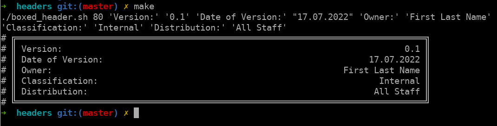

# Intro

Do you also know the situation where you just created a new file and just can't wait to start a new jam session, but something feels like still missing? 
If you also think, nothing is more appropriate to get your code file ready, but still you are not really sure what attributes you should add to the header and how to format it, then you probably have found a helper! It proposes a set of lines to start with.


# Usage

For a first header proposal just change into this folder and type:

```$ make```

# Requirements

- bash
- boxes
- Make
